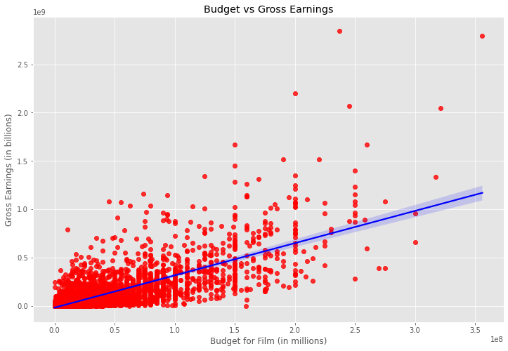
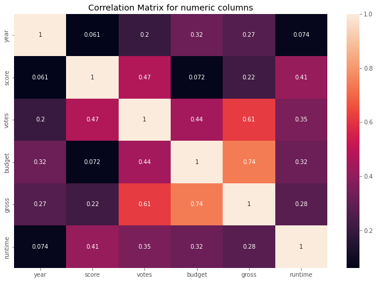

# Movie Industry Analysis

Original Dataset can be found at the following links:

* Github: https://github.com/danielgrijalva/movie-stats
* Kaggle: https://www.kaggle.com/datasets/danielgrijalvas/movies

## Overview

In this project we will perform an analysis to see if we can find factors that might affect gross earnings. We will also explore the data and visualize any interesting findings and answer questions such as what genres are most profitable. We will also perform some statistical analysis such as finding correlations in the data set to hopefully support the analysis we perform. For instance, we might wonder if there is a strong correlation between the budget for a movie and the gross earnings. 

## Brief excerpt on findings

Through our analysis we found that indeed there was a strong correlation between these two variables. After data cleaning, we went on to use simple regression where we plot budget vs gross earnings. The regression showed us that indeed there did appear to be a strong correlation

To verify that we do indeed have a strong correlation we then went on to calculate our correlation and found that indeed these two variables had a correlation coefficient of 0.74 which indicates strong correlation. The resulting correlation matrix was then plotted using a heatmap for some visualization. 

Which validates our findings of strong correlation. The full cleaning and analysis used can be [found here.](analysis.ipynb)

## License
This project is licensed under the GNU Public License - see [License](LICENSE) for details.